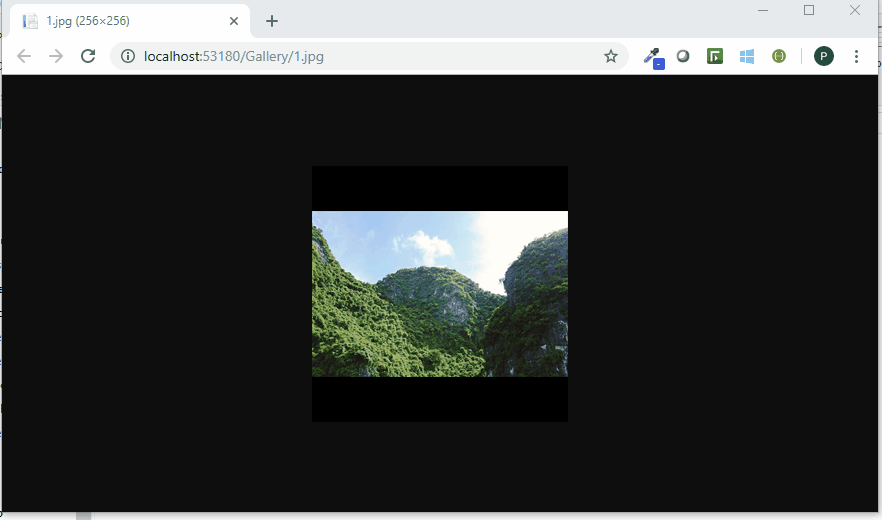
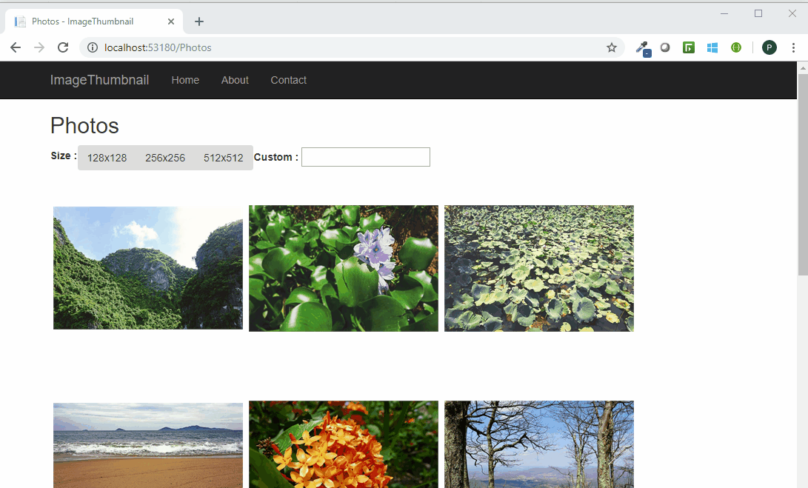

# Image Thumbnail middleware for ASP.NET Core
A middleware to serve image thumbnails with disk caching. 

## Install NuGet Package
### Using Visual Studio
`Dependencies` -> `Manage NuGet Packages...` -> Search and install `ImageThumbnail.AspNetCore.Middleware` 

### Using dotnet command
```
dotnet add package ImageThumbnail.AspNetCore.Middleware
```

### Using Package Manager
```
Install-Package ImageThumbnail.AspNetCore.Middleware
```

## Setup and configure 

Open your `Startup.cs` and configure the middleware in the `Configure` method.

### Startup.cs

```csharp
using ImageThumbnail.AspNetCore.Middleware;

public class Startup
{
      public void Configure(IApplicationBuilder app)
      {
        app.UseStaticFiles();
  		
 	ImageThumbnailOptions options = new ImageThumbnailOptions("Gallery", "Thumbnails");
    	options.ImageQuality = 75L;
    	app.UseImageThumbnail(options);
     
     	app.UseMvc();
      }
}
```


### _Sample.cshtml (ASP.NET Core Web app)
Pass size parameter as query string in image urls. 
```html
...
   <div class="item">
            
            
	     <!-- Original image -->
             <!-- Default size -->
   </div>
...
```
## Demo





## Options

The `ImageThumbnailOptions` are pretty simple.

* ImagesDirectory: Relative folder path containing your images. This folder should be at website root directory.
* CacheDirectoryName: Directory name of cache folder. A sub directory with this name will be created for caching. For example, Gallery\.thumbs
* ThumbnailBackground: This property defines background color for thumbnail. Default value is `White`
* ImageQuality: This property is used to customize the quality of thumbnails generated. Default value is `90`
* DefaultSize: This property controls default size of thumbnails when no size passes via query string. Default value is `256x256` 
